# Лабораторная работа №6
> Система контроля версий
***

### Установлен и настроен клиент Git, введено имя пользователя и адрес электронной почты.

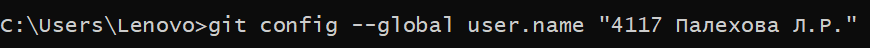
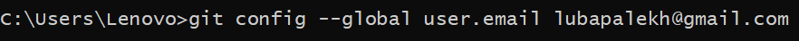

Рисунок 1

### На личный компьютер клонирован удаленный репозиторий

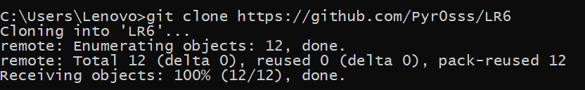

Рисунок 2

### Подтянуты изменения в локальный репозиторий

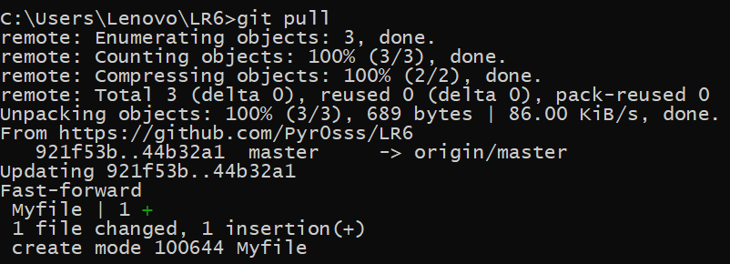

Рисунок 3

### Получена история операций для каждой из веток. Осуществлен переход между ветками.

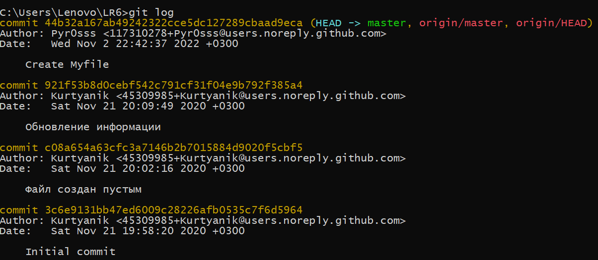
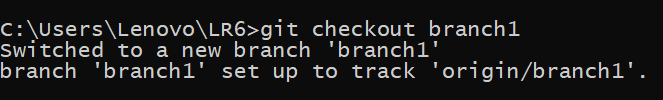
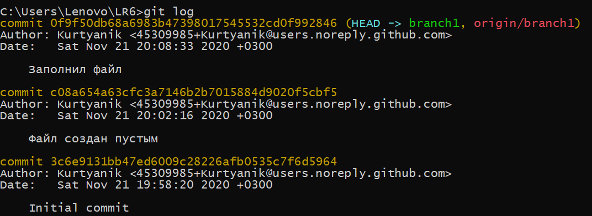

Рисунок 4

### Осуществлено слияние в ветку master. Конфликт разрешен при помощи операторов mergetool и vimdiff.

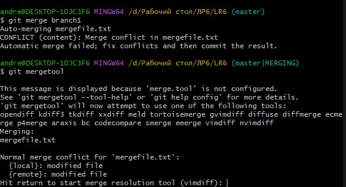
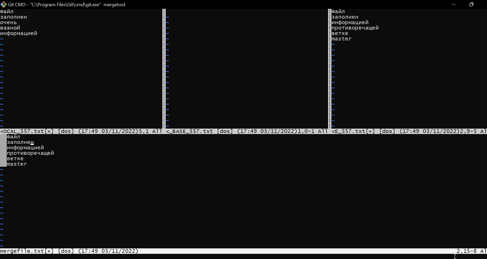

Рисунок 5

### Получен статус изменений. Результат слияния сохранен и откоммичен.

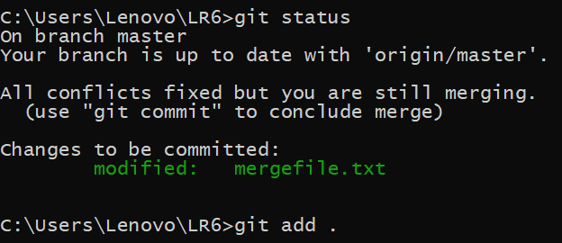

Рисунок 6

### Удалена побочная ветка.

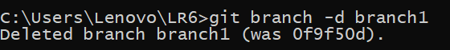

Рисунок 7

### Создан и подвержен изменениям новый файл. Данные зафиксированы.

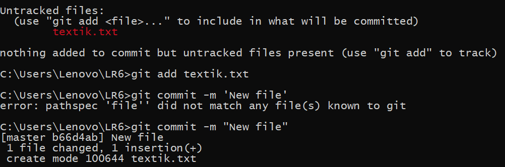

Рисунок 8

### Зафиксирован лог последних изменений.

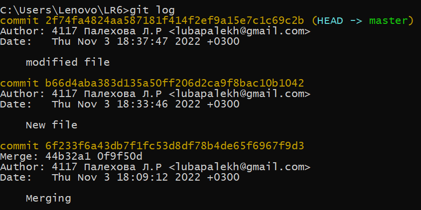

Рисунок 9

### Сделан откат коммитов.

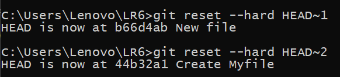

Рисунок 10

### Создана новая ветка для отчета.

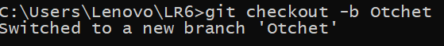

Рисунок 11

### Отчет заполнен в простейшем текстовом редакторе.

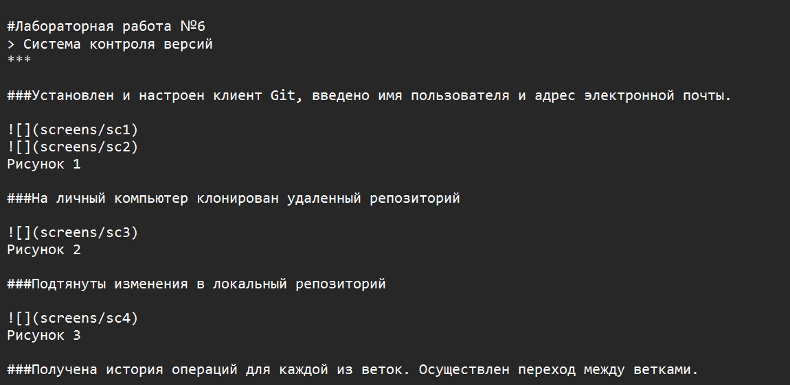

Рисунок 12

### Изменения в отчете поэтапно зафиксированы.

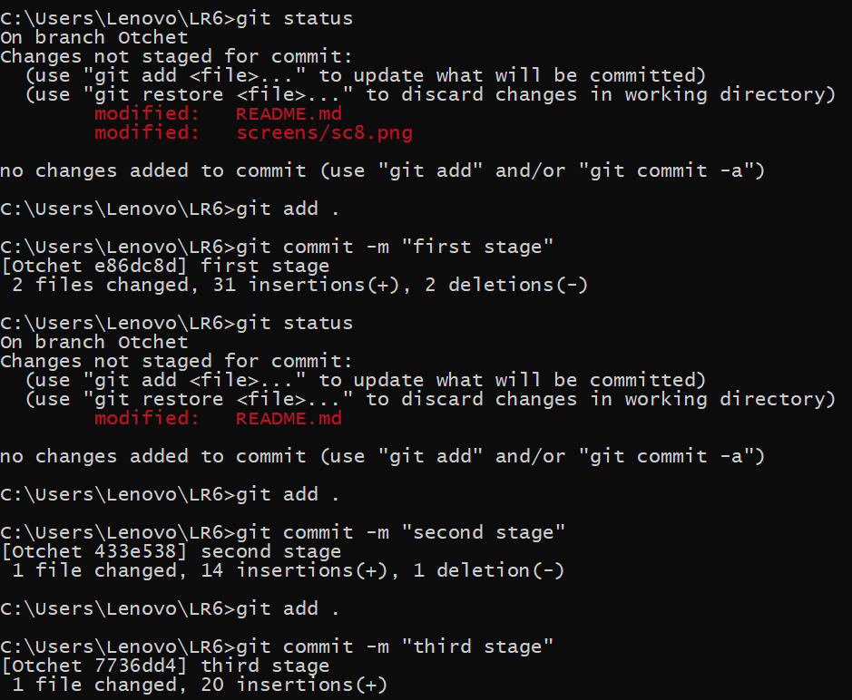

Рисунок 13

### Получена история операций в форматированном виде (сокращённый хэш + дата + имя автора + комментарий).

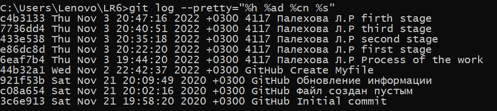

Рисунок 14

***
### Лог команд

$ cd C:/Lenovo/Users/LR6
$ git clone https://github.com/Pyr0sss/LR6.git
$ git pull
$ git log
$ git checkout branch1
$ git checkout master
$ git merge branch1
$ git mergetool
$ git status
$ git add .
$ git commit -m 'Merging'
$ git branch -d branch1
$ git branch
$ git commit -m 'New file'
$ git commit -m 'Modified file'
$ git reset --hard HEAD~1
$ git reset --hard HEAD~2
$ git checkout -b 'Otchet'
$ git log --pretty="%h %ad %ch %s"
